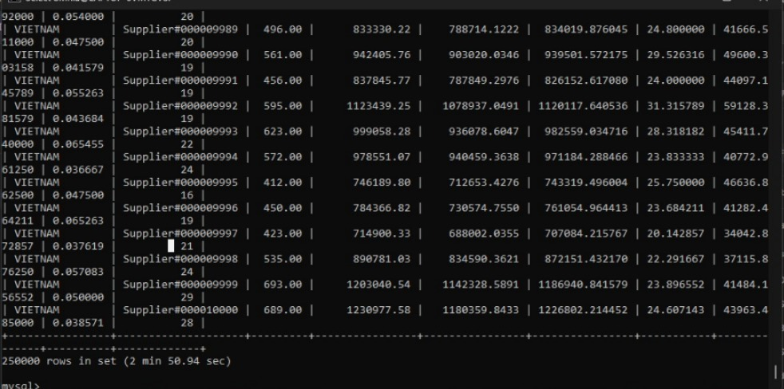
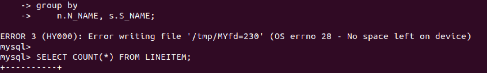
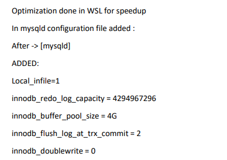
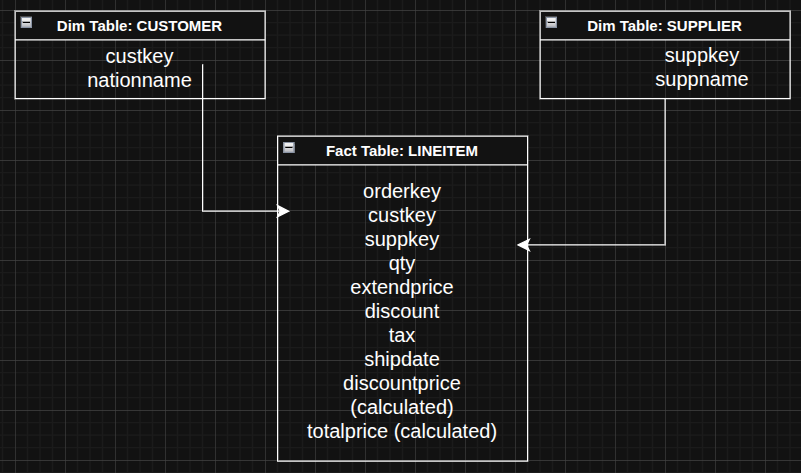
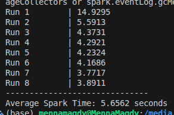

# DESIGNING DATA INTENSIVE APPLICATIONS
# LAB01: TPCH Data Warehouse Lab


## 1. Preparing the OLTP Database

The first step was preparing the **transactional database (OLTP)** using the TPCH dataset.

The OLTP schema is highly normalized (3NF) and optimized for transactional workloads rather than analytical queries.

### Steps

1. Install MySQL.
2. Create a TPCH database.

```sql
CREATE DATABASE tpch;
USE tpch;
```

3. Import the TPCH tables:

- customer
- orders
- lineitem
- supplier
- nation
- region
- part
- partsupp

These tables represent the **normalized transactional schema (3NF)**.

---

# 2. Query Analysis

Before designing the data warehouse, the analytical query provided in the lab was analyzed.


```sql
select
    n.N_NAME as n_name,
    s.S_NAME as s_name,
    sum(l.l_quantity) as sum_qty,
    sum(l.l_extendedprice) as sum_base_price,
    sum(l.l_extendedprice * (1 - l.l_discount)) as sum_disc_price,
    sum(l.l_extendedprice * (1 - l.l_discount) * (1 + l.l_tax)) as sum_charge,
    avg(l.l_quantity) as avg_qty,
    avg(l.l_extendedprice) as avg_price,
    avg(l.l_discount) as avg_disc,
    count(*) as count_order
from
    lineitem l
    join orders o on l.l_orderkey = o.o_orderkey
    join customer c on o.o_custkey = c.c_custkey
    join nation n on c.c_nationkey = n.n_nationkey
    join partsupp ps on l.l_partkey = ps.ps_partkey and l.L_SUPPKEY = ps.ps_suppkey
    join supplier s on ps.ps_suppkey = s.s_suppkey
where
    l_shipdate <= date '1998-12-01' - interval '90' day
group by
    n.N_NAME, s.S_NAME;
```



| Run | OLTP (min) | 
|----------|----------|
| Run 1    | 2 min 50.94 sec | 
| Run 2    | 3 min 11.49 sec  | 
| Run 3    | 2 min 39.52 sec  | 
| Run 4    | 2 min 55.83 sec | 
| Run 5    | 2 min 42.87 sec  | 
| Run 6    | 3 min 44.34 sec  | 
| Run 7    |3 min 28.06 sec | 
| Run 8    | 3 min 50.30 sec  | 
| Average  | 3 min 10.42 sec | 


Problems:




Solution:


---

# 3. Designing the Star Schema

For OLAP workloads, a **Star Schema** was designed.

A star schema improves performance for analytical queries by reducing the number of joins required.




---

# 4. Designing the ETL Process

The ETL process converts the **OLTP schema into the star schema**. It reads from MySQL, performs the transformation into star schema, and loads the data into parquet files. 

ETL stages:

Extract → Transform → Load

---

## Extract

Data is extracted from the OLTP MySQL tables. This stage only involves fetching the data from the source tables and providing input for the transformation stage.

---

## Transform

The data is converted into a target structure appropriate for OLAP supported schemas, which is the Star Schema here. Some operations to achieve this transformation include:
- Table joins
- Filter on rows
- Denormalizing normalized schemas
---

## Load

The transformed data is stored in **Parquet format**.

Parquet was chosen because:
- Columnar storage
- High compression
- Optimized for analytical engines (Spark OLAP queries)

---

# 5. Installing the ETL Tool

The ETL pipeline was implemented using Apache NiFi.

NiFi provides a visual interface to create and manage data pipelines.

---

## Installation Steps

1. Download NiFi 2.8.
2. Extract the archive.

Example installation directory:

```
/opt/nifi/nifi
```

3. Start NiFi:

```bash
./bin/nifi.sh start
```

4. Open the NiFi user interface:

```
http://localhost:8443/nifi
```

---

# 6. Installing Required NiFi Extensions

To support Parquet processing, the following extensions were installed:

- nifi-parquet-nar
- nifi-hadoop-libraries-nar

These files were placed inside the extensions directory:

```
/opt/nifi/nifi/extensions/
```

After adding the files, NiFi was restarted.

---

# 7. Connecting NiFi to MySQL

To connect NiFi to the MySQL database, a JDBC driver was installed.

Driver used:

```
mysql-connector-j-9.6.0.jar
```

The driver file was placed inside:

```
/opt/nifi/nifi/lib
```

---

## Configuring DBCPConnectionPool

A **DBCPConnectionPool controller service** was configured in NiFi.

Configuration:

Database Connection URL

```
jdbc:mysql://localhost:3306/tpch
```

Driver Class Name

```
com.mysql.cj.jdbc.Driver
```

Driver Location

```
/opt/nifi/nifi/lib/mysql-connector-j-9.6.0.jar
```

Username

```
root
```

Password

```
<mysql password>
```

---

# 8. Generating Parquet Files with NiFi

NiFi processors are used to execute the ETL workflow. Prcoessors were selected to serve each stage of the ETL pipeline:
* **Extract**: ExecuteSQL processor takes the input data from the batch fetching output from the processor GenerateTableFetch, and executes SQL statements to read from the OLTP tables. The batching is vital to avoid OOM errors in NiFi.
* **Transform**: ConvertAvroToParquet takes the Avro-format data from ExecuteSQL and transforms it into a columnar format (Parquet).
* **Load**: PutFile and PutParquet ensure that parquet data is saved to a local file system and is persisted in the same format for later processing. 

Typical pipeline:

```
GenerateTableFetch
      ↓
ExecuteSQL
      ↓
ConvertAvroToParquet
      ↓
PutFile
```


Output files generated:

```
customer.parquet
supplier.parquet
lineitem.parquet
```

These files represent the analytical dataset.

---

# 9. Installing the Analytical Engine

To run analytical queries efficiently, Apache Spark was installed.

Spark provides distributed data processing and supports Parquet natively.

---

## Spark Installation

Downloaded version:

```
Spark 3.5.8
```

Package type:

```
Pre-built for Hadoop 3.3+
```

Extracted directory example:

```
~/spark-3.5.8-bin-hadoop3
```

---

# 10. Verifying Spark Installation

Spark was tested using:

```bash
spark-shell
```

Expected output:

```
Spark session available as 'spark'
```

This confirmed that Spark was installed correctly.

---

# 11. Installing PySpark

To run Spark using Python, PySpark was installed.

Installation command:

```bash
pip install pyspark
```

---

# 12. Testing PySpark

A simple script was used to verify PySpark functionality.

```python
from pyspark.sql import SparkSession

spark = SparkSession.builder.appName("Test").getOrCreate()

spark.range(10).show()
```

Example output:

```
+---+
| id|
+---+
| 0 |
| 1 |
| 2 |
| 3 |
| 4 |
| 5 |
| 6 |
| 7 |
| 8 |
| 9 |
+---+
```

This confirmed successful integration between:

- Python
- Spark
- Java
- PySpark

---

# 13. Preparing Analytical Queries

Once Parquet files are available, OLAP queries can be executed using Spark.

Typical workflow:

```
Read Parquet → Join Dimensions → Aggregate Results
```

Example PySpark code:

```python
lineitem = spark.read.parquet("lineitem.parquet")
supplier = spark.read.parquet("supplier.parquet")
nation = spark.read.parquet("nation.parquet")

result = lineitem.join(supplier, "suppkey") \
                 .join(nation, "nationkey") \
                 .groupBy("n_name","s_name") \
                 .agg({"l_quantity":"sum"})
```


Query we used:
```python
        SELECT
            c.N_NAME as nation,
            s.S_NAME as supplier,
            SUM(CAST(f.QUANTITY AS DOUBLE)) as sum_qty,
            SUM(CAST(f.EXTENDEDPRICE AS DOUBLE)) as sum_base_price,
            SUM(CAST(f.EXTENDEDPRICE AS DOUBLE) * (1 - CAST(f.DISCOUNT AS DOUBLE))) as sum_disc_price,
            AVG(CAST(f.QUANTITY AS DOUBLE)) as avg_qty,
            COUNT(*) as count_order
        FROM
            fact f
            JOIN customer c ON f.C_CUSTKEY = c.C_CUSTKEY
            JOIN supplier s ON f.S_SUPPKEY = s.S_SUPPKEY
        WHERE
            f.SHIPDATE <= '1998-09-02'
        GROUP BY
            c.N_NAME, s.S_NAME
```

---

# 14. Final System Architecture

The full architecture of the system is:

```
TPCH OLTP Database (MySQL)
           ↓
      Apache NiFi
           ↓
     Parquet Files
           ↓
      Apache Spark
           ↓
       OLAP Query
```

This pipeline enables efficient large-scale analytical processing.

Results



## FINAL COMPARISON


| Run | OLTP (min) | OLAP (sec)|
|----------|----------|----------|
| Run 1    | 2 min 50.94 sec | 14.9295 sec
| Run 2    | 3 min 11.49 sec  | 5.5913 sec
| Run 3    | 2 min 39.52 sec  | 4.3731 sec
| Run 4    | 2 min 55.83 sec | 4.2921 sec
| Run 5    | 2 min 42.87 sec  | 4.2324 sec
| Run 6    | 3 min 44.34 sec  | 4.1686 sec
| Run 7    |3 min 28.06 sec | 3.7717 sec
| Run 8    | 3 min 50.30 sec  | 3.8911 sec
| Average  | 3 min 10.42 sec | 5.6562 sec
 